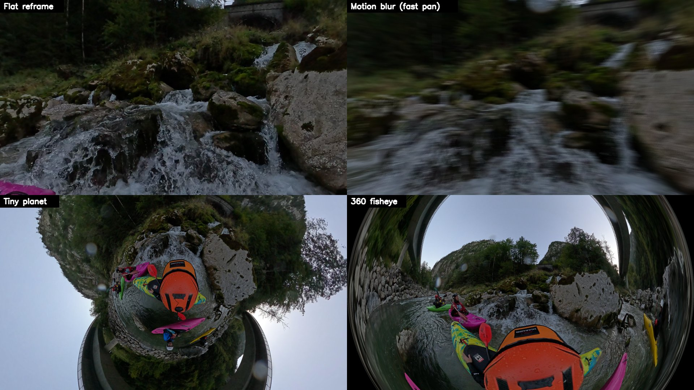
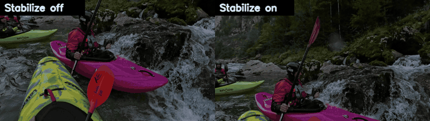
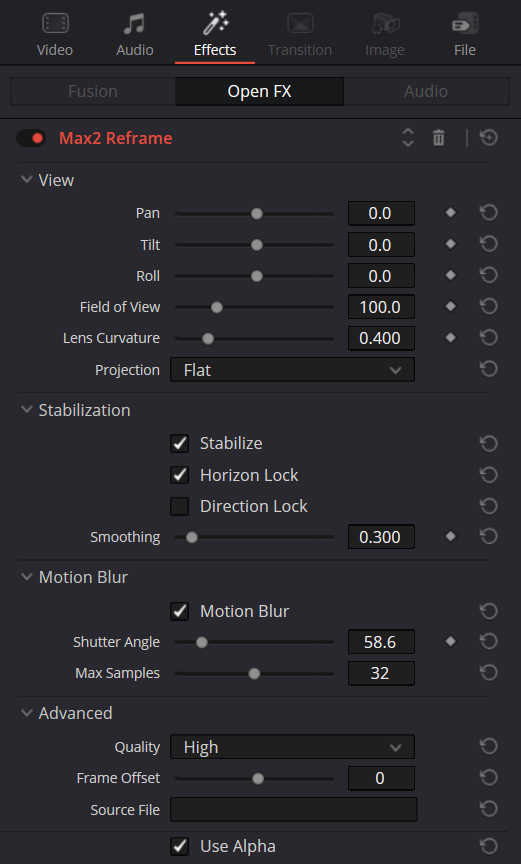

# Max2 Reframe for DaVinci Resolve

Max2 Reframe is an OpenFX plugin for DaVinci Resolve on Windows. It reframes GoPro Max 2 `.360` files on the Edit page. It reads the original file, so you do not export from GoPro Player first. Stabilization, horizon lock and direction lock are plugin settings. You can change them at any time.

## Why this plugin exists

The GoPro workflow for Resolve has these steps:

1. Export each `.360` file to an equirectangular MP4 with the GoPro Player batch exporter.
2. Import the MP4 files into Resolve.
3. Make proxy media, because 8K HEVC plays slowly.
4. Reframe each clip with the GoPro Reframe OpenFX plugin.

This workflow has these problems:

- GoPro Player applies stabilization, horizon lock and direction lock during the export. To change one of them, you must export, import and make proxies again.
- The exports take hours and use much disk space. It is easy to lose track of which export has which settings.
- The GoPro Reframe plugin has no stabilization or direction lock settings.
- The GoPro Reframe plugin works only on the Fusion page. Fusion does not use proxy media.
- The GoPro Reframe plugin fails when Resolve uses CUDA. It works only with OpenCL or with GPU processing off.
- On an RTX 3060 laptop, an 8K render with GoPro Reframe ran at 1.3 frames per second. Playback was approximately 1 frame per second.

## What Max2 Reframe does

- Reads the two lens streams of the `.360` file at full resolution. The GPU decodes the HEVC video. This also works in the free version of Resolve.
- Stabilizes with the gyro data in the `.360` file. The result is within approximately 1 degree of GoPro Player.
- Works on the Edit page.
- Renders with CUDA or OpenCL, as set in Resolve. If the GPU fails, it renders with the CPU.
- Gives a lens control from rectilinear to stereographic (tiny planet) to a 360-degree fisheye.
- Adds motion blur to pans, tilts, zooms and heading changes.
- Gives a full stabilized 360 output (equirectangular, 2:1).

On an RTX 3060 laptop GPU, one UHD frame takes approximately 8 ms to render with CUDA. With the decode, playback runs at approximately 45 frames per second. These values come from the test tool, not from Resolve.

## Requirements

- Windows 10 or 11, 64-bit.
- DaVinci Resolve 21. The tests used Resolve 21.1 (free).
- A GoPro Max 2. The original GoPro Max has the same file layout, but it is not tested.
- The HEVC Video Extensions from the Microsoft Store. Windows uses them to decode the video.
- A GPU. The tests used an NVIDIA RTX 3060 with CUDA and OpenCL.

## Install

1. Close DaVinci Resolve.
2. Download `Max2Reframe-<version>-win64.zip` from the [Releases](https://github.com/Sean-McConnachie/max2-reframe-resolve/releases) page.
3. Extract the zip file.
4. Double-click `Install.bat`.
5. When Windows asks for administrator permission, click **Yes**.
6. Start DaVinci Resolve.

The installer puts a small loader in `C:\Program Files\Common Files\OFX\Plugins`. Only this step needs administrator permission. The plugin itself goes into `%LOCALAPPDATA%\Max2Reframe`. Updates replace only this folder.

If Windows SmartScreen stops `Install.bat`, click **More info**, then click **Run anyway**.

To remove the plugin, close Resolve and double-click `Uninstall.bat`.

## Use

1. In Resolve, open your project.
2. Select **Workspace > Scripts > Import GoPro 360**.
3. Select the folder with your `.360` files. The script imports all `.360` files in the folder and its subfolders.
4. Put a clip on the timeline.
5. In the Effects panel, open **OpenFX > GoPro 360**.
6. Drag **Max2 Reframe** onto the clip.
7. In the Inspector, set the view and the stabilization.

Resolve does not import files with the `.360` extension. The script gives each `.360` file a second name that ends in `.mp4`. This second name is an NTFS hard link, so it uses no disk space. The links are in a hidden `_Max2Reframe` folder next to your files.

## Settings

| Setting | What it does |
|---|---|
| Pan, Tilt, Roll | Set the view direction in degrees. For a spin, use keyframes past 360 degrees. |
| Field of View | Sets the horizontal angle of the view, up to 360 degrees. |
| Lens Curvature | 0 is rectilinear. 1 is stereographic (tiny planet). 2 is a fisheye. |
| Projection | **Flat** gives a reframed view. **Equirectangular 360** gives the full stabilized sphere. |
| Stabilize | Removes the camera rotation with the gyro data. |
| Horizon Lock | Keeps the horizon level. |
| Direction Lock | On: the view points in one direction in the world. Off: the view follows the camera heading. |
| Smoothing | Sets how slowly the view follows the camera heading, in seconds. |
| Motion Blur, Shutter Angle | Blur the view movement during the shutter time. 180 degrees is half of one frame. |
| Max Samples | Sets the maximum number of blur samples for each pixel. A lower value renders faster. |
| Quality | **High** uses 2 x 2 samples for each pixel. |
| Frame Offset | Moves the picture forward or back by frames, if it is not in sync with the timeline. |
| Source File | Sets the `.360` file manually, if the plugin cannot find it. |

## Troubleshooting

- **The plugin is not in the Effects panel.** Close Resolve and run `Install.bat` again. The installer also clears the plugin cache of Resolve.
- **The picture is the original clip, not the reframed view.** The clip is not a `.360` file. Import it with the **Import GoPro 360** script.
- **Other problems.** Read the log file at `%LOCALAPPDATA%\Max2Reframe\max2reframe.log`.

## Build from source

You need Visual Studio 2022 with the C++ tools and the CUDA Toolkit 12.

1. Run `build.bat`.
2. Close DaVinci Resolve.
3. Run `powershell -ExecutionPolicy Bypass -File install.ps1`.

`tools\package.ps1` makes the release zip in `dist\`. `build\max2render.exe` renders frames without Resolve. The comment at the top of `tools\max2render.cpp` lists its options.

## How it works

- In each render call, Resolve gives the path of the source file. The plugin decodes this file itself, because Resolve gives Edit page effects only timeline resolution.
- A Max 2 `.360` file has two 5888 x 1920 HEVC streams in the equi-angular cubemap (EAC) layout of GoPro. CUDA, OpenCL and the CPU use one shared sampling function in `src/reframe_kernel.h`.
- The camera orientation comes from the CORI and IORI quaternions in the GPMF metadata track. Horizon lock uses the GRAV gravity vector. The Python scripts in `proto/` fit this model to GoPro Player exports.

## License

MIT. See `LICENSE`. The OpenFX files in `third_party/openfx` use the BSD-3-Clause license. See `THIRD-PARTY-NOTICES.md`.
